# Stabmatic User Manual

**Pre-release.** Stabmatic has not shipped yet; this manual describes the
build currently in testing. The About panel shows the version you are running.

---

## Table of Contents

1. [What it does](#what-it-does)
2. [Installing](#installing)
3. [Getting sound out of it](#getting-sound-out-of-it)
4. [The panel](#the-panel)
5. [Playing it](#playing-it)
6. [The chord library](#the-chord-library)
7. [Making your own](#making-your-own)
8. [Saving and organising](#saving-and-organising)
9. [Settings](#settings)
10. [Automation](#automation)
11. [When something is wrong](#when-something-is-wrong)
12. [What is not in it yet](#what-is-not-in-it-yet)

---

## What it does

Stabmatic remembers a chord shape and plays it back transposed to whatever
note you press. Play C, you get the shape rooted on C. Move up to D, the
whole shape moves up a whole step — every note in it, by the same amount. It
is Roland's **Chord Memory** function, the one built into the Alpha Juno and
the MC-909, as a plugin.

The one-sentence version: Stabmatic does not know what key you're in, does
not correct your voicing, and does not care what came before — it takes the
shape it currently holds and slides it, rigidly, to the note you played. That
rigidity is the whole point. A "smart" chord plugin tries to keep you in
key and picks a sensible voicing for you; Stabmatic does neither, and that is
what makes it useful for the parallel harmonic movement of house, techno,
rave and jungle, where the same chord quality is supposed to slide
chromatically under a bassline rather than reharmonise with it.

Roland, MC-909, Alpha Juno and MKS-50 are trademarks of Roland Corporation.
Stabmatic is an independent project and is not affiliated with, endorsed by,
or sponsored by Roland Corporation.

## Installing

Stabmatic is a MIDI instrument, not an audio effect — it has no sound of its
own, so there is nothing for it to do outside a DAW. There is no standalone
build, and there will not be one.

| Format | Platform | Availability |
|---|---|---|
| VST3 | Windows | Available now |
| CLAP | Windows | Available now |
| VST3, CLAP | macOS | Planned — no date yet |
| LV2 | Linux | Planned — no date yet |
| AU | macOS | Not yet. Stabmatic ships VST3 and CLAP on macOS; an Audio Unit may follow |

Install locations:

| Format | Windows |
|---|---|
| VST3 | `C:\Program Files\Common Files\VST3\` |
| CLAP | `C:\Program Files\Common Files\CLAP\` |

The Windows installer places both formats automatically and installs the
Microsoft Edge WebView2 Runtime — required for Stabmatic's interface — if it
isn't already present on your system.

If your installer put the files somewhere else, rescanning your plugin
folders in your DAW's preferences is usually enough to find them.

### Windows SmartScreen

The installer isn't code-signed yet, so Windows may show a "Windows
protected your PC" warning when you run it. Click **More info**, then **Run
anyway**. This is Windows being cautious about an unfamiliar publisher, not
a sign anything is wrong with the download.

## Getting sound out of it

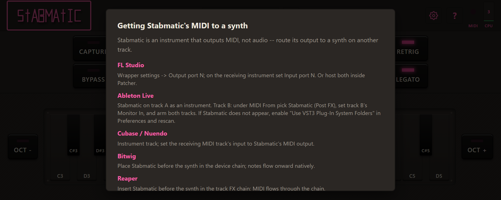

*The routing hint appears the first time Stabmatic opens. You can reopen it from the About panel.*

This is where people get stuck, so read it before you do anything else.

Stabmatic doesn't make sound — it makes MIDI. You play one note into it, and
it sends out a full chord's worth of MIDI notes. Something downstream has to
turn those notes into audio, which means a synth has to be listening to
Stabmatic's output. This is also why Stabmatic loads as an *instrument*
rather than a MIDI effect: Ableton Live refuses to load third-party MIDI
effects at all, so an instrument shape is the only shape that works
everywhere.

The routing step differs by host. Here is the recipe for each, in order of
how likely you are to be using it.

### FL Studio (primary target)

In Stabmatic's wrapper settings, set the **output port** to a number, say
port 1. On the synth you want to hear, set its **input port** to the same
number. Alternatively, host both Stabmatic and the synth inside a Patcher
rack, where you can wire Stabmatic's MIDI output straight to the synth's
MIDI input.

### Ableton Live

Put Stabmatic on a track as an instrument. On a second track holding your
synth, open the **MIDI From** dropdown and pick **Stabmatic (Post FX)**.
Set that second track's monitor to **In**, and arm both tracks. If
Stabmatic doesn't show up in your plugin list at all, go to
Preferences → Plug-Ins, enable **Use VST3 Plug-In System Folders**, and
rescan.

### Cubase / Nuendo

Put Stabmatic on an instrument track. On the MIDI track you want to hear,
set its input to Stabmatic's MIDI output.

### Bitwig Studio

Place Stabmatic before the synth in the same device chain. Notes flow
through to the synth on their own — no extra routing needed.

### Reaper

Insert Stabmatic before the synth in the track's FX chain. MIDI flows
through the chain the same way it does in Bitwig.

### Logic Pro

If your build ships as an AU MIDI FX, insert it in the track's MIDI FX
slot. Stabmatic doesn't ship as AU yet (see Installing, above), so this
recipe is for when it does.

### Studio One

In the Instrument Editor, set the synth's **Instrument Output** to
Stabmatic, and set Stabmatic as the synth's **Direct Input**.

### Cakewalk

Put Stabmatic on a MIDI track. On the instrument track, set its **Input**
to Stabmatic and its **Output** to an aux bus, then turn on **Input Echo**
on the instrument track.

### Reason — not supported

Reason cannot route MIDI out of a hosted plugin. There is no routing recipe
because there is no route. This isn't a Stabmatic limitation to work around;
it's a wall in the host.

The first time you open Stabmatic, it shows you this same list once, so you
don't have to come back here. You can reopen it any time from the About
panel.

## The panel

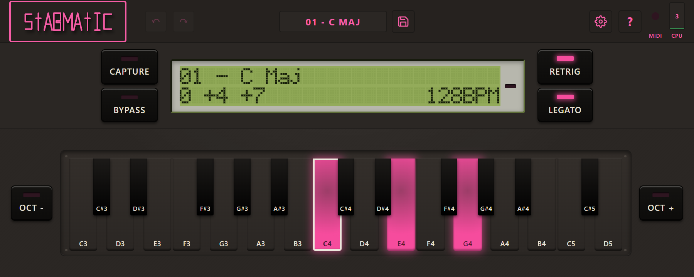

*The panel with the Stock LCD skin, the dark theme and form 01, C major, loaded.*

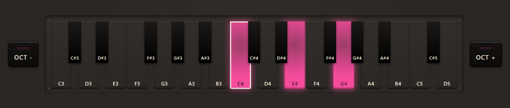

*The keyboard lights the notes of the loaded form.*

Reading left to right, top to bottom.

**The header bar.** The Stabmatic wordmark sits at the left. Next to it are
**Undo** and **Redo**, which step back and forward through your recent chord
edits — dimmed when there's nothing to undo or redo. Centred in the bar is
the **name button**: it shows the name of whatever chord form is currently
loaded, and clicking it opens the chord browser. Beside the name is the
**Save** button, which lights up whenever you've changed the loaded form
without saving it. On the right: a **settings** button, an **about** button,
a **MIDI** light that glows pink on any incoming note, and a **CPU**
meter showing how much processing time Stabmatic is using.

**Capture and Bypass**, on the left of the row below the header. Capture
arms chord capture — see Making your own, below. Bypass passes MIDI straight
through unmodified and stops Stabmatic making any chords at all.

**The display**, in the centre of that row. It's a small dot-matrix screen,
two lines. The top line shows the number and name of the loaded chord form
— `01 - C Maj`, or `U017 My Stab` for something you saved yourself — with an
asterisk after the name if you've changed it since it loaded. An `[ARP]`
badge appears here for the arpeggio-voiced forms (see The chord library,
below). The bottom line shows the semitone offsets that make up the current
chord, updating live as you edit, and your host's tempo in the corner when
your DAW reports one. During capture, this line shows what you've played so
far instead. Clicking the display opens the chord browser, same as the name
button.

**Retrig and Legato**, on the right of that row — see Playing it, below.

**The pad grid and octave buttons**, below all of that. The grid is a
piano-style keyboard, about two octaves wide, centred on C4. Lit pads are
the notes currently in your chord. `OCT -` and `OCT +` on either side of the
grid page the visible range up and down, from C1 at the low end to D6 at the
high end — wide enough to reach and edit every factory form, including the
ones that spread notes far above or below C4.

## Playing it

Hold one key. You get a chord — whatever shape is currently loaded,
transposed to that key. Move to a different key while still holding, or
release and press another, and the chord moves with you.

**Retrig** controls what happens at that moment of change. With Retrig on
(the default), every note in the chord releases and re-attacks — a stab.
With Retrig off, any note common to the old chord and the new one is held
through the change rather than re-triggered, and only the notes that differ
actually move — closer to how a pad or a string patch behaves when you
voice-lead it by hand.

**Legato** controls what happens when you let go. With Legato on (the
default), releasing the key you're holding while an earlier key is still
down returns you to that earlier key's chord — the way a mono synth returns
to a held note. With Legato off, releasing stops the chord outright, and an
earlier held key is ignored until you press it again.

Only one chord sounds at a time. Notes are reduced to one voice before they
reach the chord engine, last-note priority, so overlapping notes in a MIDI
clip replace each other rather than stacking into a pile of chords.

Everything that isn't a note-on or a note-off passes straight through,
unmodified: velocity, sustain pedal, pitch bend, aftertouch, mod wheel,
program changes, system exclusive, all of it. Velocity in particular
applies to the whole chord exactly as you played it — there's no separate
velocity per chord note. This matters because it means your synth's own
envelope, expression and pedal behaviour work exactly as they would without
Stabmatic in the chain. Stabmatic only ever touches which notes sound, never
how they sound.

## The chord library

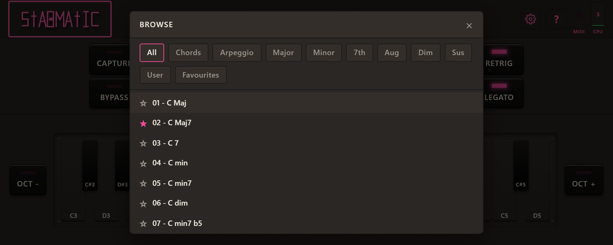

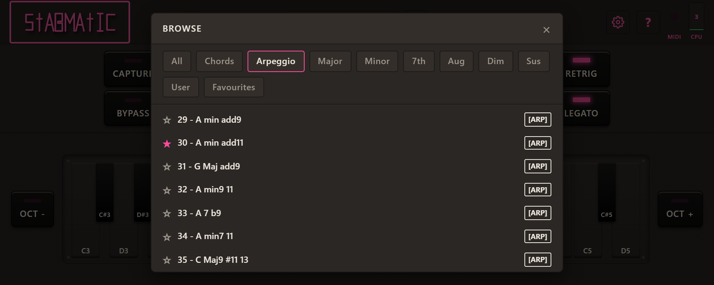

*The Arpeggio filter shows forms 29 to 64, each marked [ARP].*

Stabmatic ships with the Roland MC-909's 64 factory chord forms, transcribed
from the machine's owner's manual. Forms 1 through 28 are ordinary chords —
triads, sevenths, sixths, extensions. Forms 29 through 64 are voiced
differently: wider spreads, notes below the root, chords with the root left
out entirely. Roland designed these for use with the MC-909's arpeggiator,
so they carry an `[ARP]` badge in the display and the browser to tell you
they're built for that rather than for playing as a block chord.

A few of Roland's factory forms don't quite match their own names, and
Stabmatic keeps them exactly as printed rather than correcting them — form 6,
"C dim", is voiced as a diminished seventh chord, and form 48, "G Maj", is
literally a C major triad. That's the hardware's own inconsistency, not a
bug here.

The chord browser (opened from the name button or the display) lists all 64
factory forms and everything in your own library. A star toggle beside each
row marks it as a favourite. A row of filter tabs above the list narrows it
down: **All**, **Chords** (1–28), **Arpeggio** (29–64), six quality filters —
**Major**, **Minor**, **7th**, **Aug**, **Dim**, **Sus** — then **User** and
**Favourites**. The quality filters match on the chord's name, so a form
named "C min7" shows up under both Minor and 7th.

The 64 factory forms, by number and name:

| # | Name | | # | Name |
|---|---|---|---|---|
| 01 | C Maj | | 33 | A 7 b9 |
| 02 | C Maj7 | | 34 | A min7 11 |
| 03 | C 7 | | 35 | C Maj9 #11 13 |
| 04 | C min | | 36 | A min6 9 11 |
| 05 | C min7 | | 37 | C min7 11 |
| 06 | C dim | | 38 | G Maj add9 |
| 07 | C min7 b5 | | 39 | B Maj7 |
| 08 | C Aug | | 40 | D sus4 |
| 09 | C sus4 | | 41 | A min |
| 10 | C 7sus4 | | 42 | C sus4 |
| 11 | C add9 | | 43 | A min |
| 12 | C #11 | | 44 | G sus4 |
| 13 | C min7 b9 | | 45 | A |
| 14 | C min add9 | | 46 | F Maj |
| 15 | C 6 | | 47 | A |
| 16 | C 6 9 | | 48 | G Maj |
| 17 | C Maj9 | | 49 | C min9 11 |
| 18 | C min6 | | 50 | A min9 11 |
| 19 | C min9 | | 51 | A min9 11 |
| 20 | C min Maj7 | | 52 | E 7 #11 13 |
| 21 | C 7 b5 | | 53 | A min9 |
| 22 | C 7 b9 | | 54 | A min9 |
| 23 | C 9 | | 55 | A min9 |
| 24 | C 7 #9 | | 56 | A min9 11 |
| 25 | C 7 #11 | | 57 | F Maj9 #11 |
| 26 | C Aug7 | | 58 | A min9 11 |
| 27 | C 7 b13 | | 59 | A min9 11 |
| 28 | C 7 13 | | 60 | G min9 |
| 29 | A min add9 | | 61 | C Maj9 |
| 30 | A min add11 | | 62 | F Maj9 |
| 31 | G Maj add9 | | 63 | F Maj9 13 |
| 32 | A min9 11 | | 64 | F Maj9 #11 |

Names 31 and 38 are both "G Maj add9", 41 and 43 are both "A min", and 45
and 47 are both "A" — each pair is a different voicing of the same name,
exactly as Roland shipped them.

## Making your own

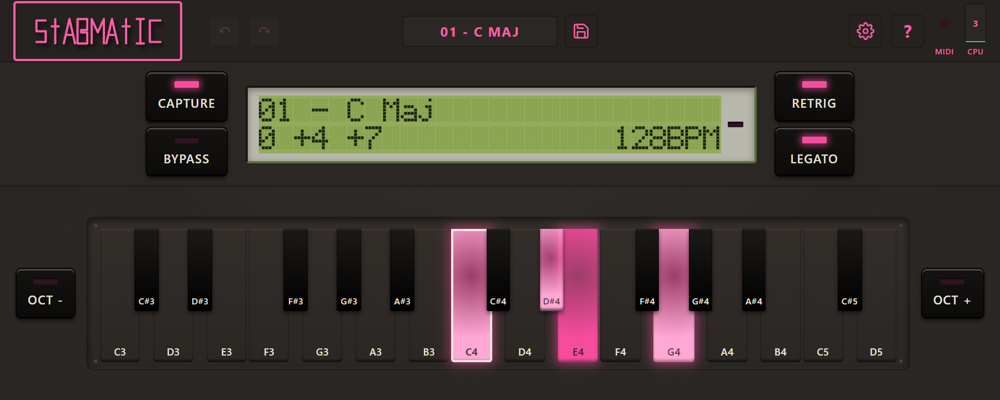

*Capture armed: the keys played so far are lit.*

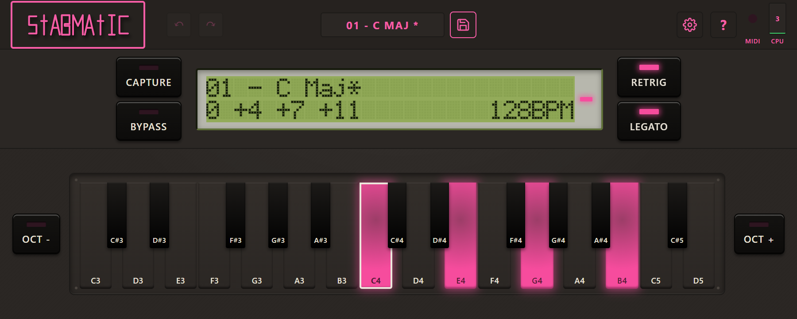

*An edited form. The asterisk and the EDIT light mean it differs from the saved version.*

There are two ways to build a chord form that isn't in the factory list.

**Capture.** Press Capture to arm it. Play a chord — all at once, or one
note at a time, as long as at least one key stays held while you do it.
Release every key, and the shape you played becomes your current chord
immediately. The lowest note you played becomes the root; everything else
is measured from it. A single note captured alone gives you a one-note
"chord" — unison pass-through, not a bug. Up to 12 distinct notes are
collected; a 13th is ignored and the display flashes to tell you.

**Editing on the pad grid.** Click a lit pad to remove that note from the
chord, click an unlit one to add it. This works on any loaded form,
including a factory one — clicking a pad never changes the factory form
itself, only what's currently playing.

The rule that matters most: whatever you're playing right now — captured,
edited, or untouched — survives closing and reopening your project, whether
or not you ever saved it to your library. Loading a different form from the
browser replaces what you're playing and throws away anything unsaved, but
that discard is one step of Undo away, no confirmation dialog involved.

## Saving and organising

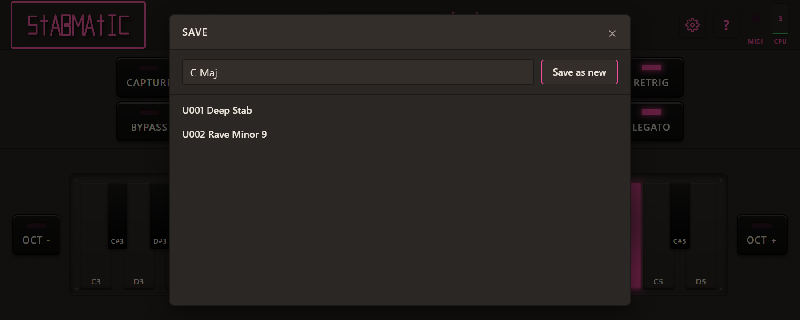

*Saving. The name starts from the source form, and your existing entries are listed as overwrite targets.*

Nothing you capture or edit is written to your library until you say so.
Press **Save** to open the browser in save mode. From there you can:

- **Save as new** — adds your current chord to your library under a name
  you choose.
- **Overwrite** an existing entry in your library — pick it from the list,
  confirm, and it's replaced. Factory forms can never be overwritten.
- **Rename** or **delete** any entry you own, from the regular browser view.
  Deleting asks for confirmation first.
- **Star** any form, factory or your own, to mark it a favourite and find it
  again quickly under the Favourites filter.

Your library has no fixed size — save as many as you like.

## Settings

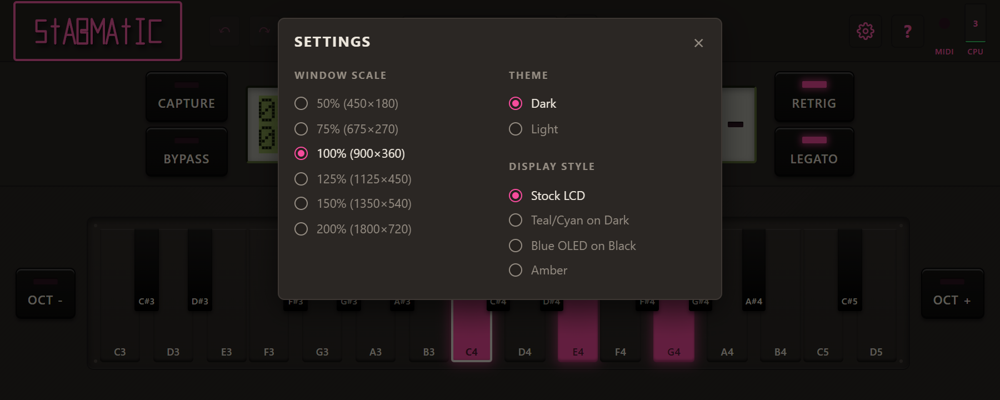

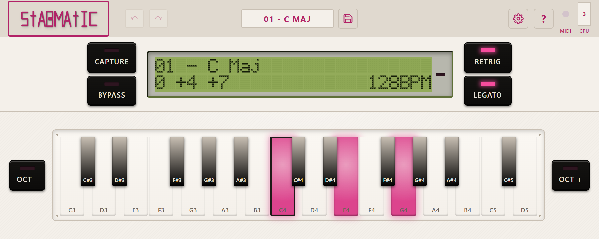

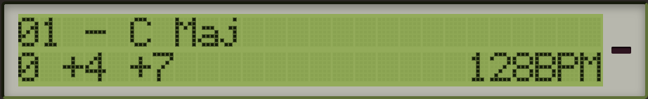
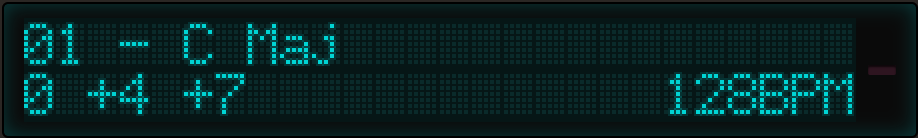
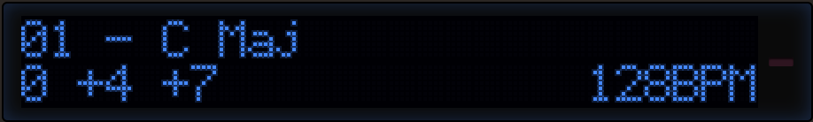
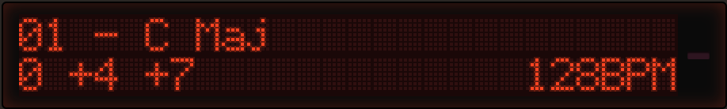

*The four display skins: Stock LCD, Teal/Cyan on Dark, Blue OLED on Black, and Amber.*

Open settings from the gear icon in the header. There are three things to
set:

- **Window scale** — 50%, 75%, 100%, 125%, 150% or 200% of the default
  window size.
- **Theme** — Dark or Light.
- **Display style** — one of four skins for the dot-matrix screen: **Stock
  LCD** (green-on-green, the default), **Teal/Cyan on Dark**, **Blue OLED on
  Black**, and **Amber**.

Theme and display style are remembered separately for each instance of
Stabmatic in your project.

## Automation

The parameter you'll actually want to automate is **Chord Form** — it picks
which entry in your library is currently playing. Its value runs from the
64 factory forms up through your own library in save order; your DAW shows
the form's name in the automation lane rather than a bare number. Changing
it while a chord is sounding loads the new form immediately, discarding any
unsaved edit exactly as picking it by hand would — automation always wins.

One honest caveat: what happens to *notes already held* at the moment the
form changes is, today, an interim choice rather than a confirmed hardware
behaviour — Stabmatic currently holds the old voicing on sounding notes and
only applies the new form to the next note you play. This is pending a
check against real MC-909 hardware and may change.

Bypass, Retrigger and Legato are automatable too, if you want to switch
between stabs and held-tone voicings, or bypass and back, from a DAW
automation lane rather than the panel.

## When something is wrong

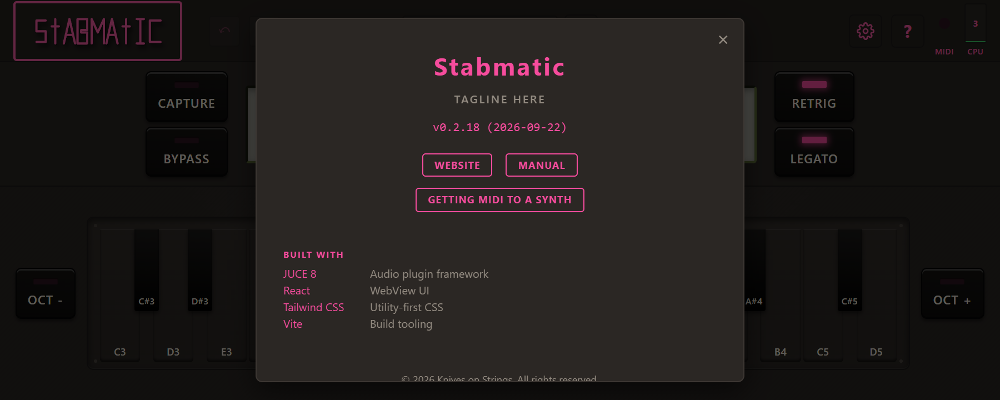

*The About panel shows the version you are running. Check it first: a DAW keeps the version it loaded until you restart it.*

**No sound.** This is almost always routing, not a bug — see Getting sound
out of it, above. Stabmatic makes MIDI, not audio; confirm a synth is
actually listening to its output.

**Stabmatic doesn't appear in Ableton Live.** Go to Preferences → Plug-Ins,
enable **Use VST3 Plug-In System Folders**, and rescan.

**A note is stuck on.** This shouldn't happen — every path that stops
Stabmatic, including Bypass and your host's panic button, is supposed to
release everything it's holding. If you find one anyway, toggle Bypass on
and off, or trigger your DAW's all-notes-off / panic function.

## What is not in it yet

- **Windows only.** VST3 and CLAP ship first. macOS and Linux are planned,
  with no date yet.
- **Reason isn't supported**, and can't be — it doesn't let a hosted plugin
  route MIDI out at all.
- **No AU build yet.** VST3 and CLAP are there; AU is waiting on being
  tested on real Mac hardware.
- **No standalone version**, and there won't be one — a MIDI instrument has
  nothing to do without a host.
- **Two behaviours are provisional** pending a check against real MC-909
  hardware: what happens to held notes when the chord form changes (see
  Automation, above), and what happens to chord notes that would fall
  outside MIDI's range — today they're dropped silently rather than folded
  or clamped.
- **Nothing phones home.** Usage reporting and the bug reporter are not
  built into current builds at all — no toggle, nothing to opt out of.
